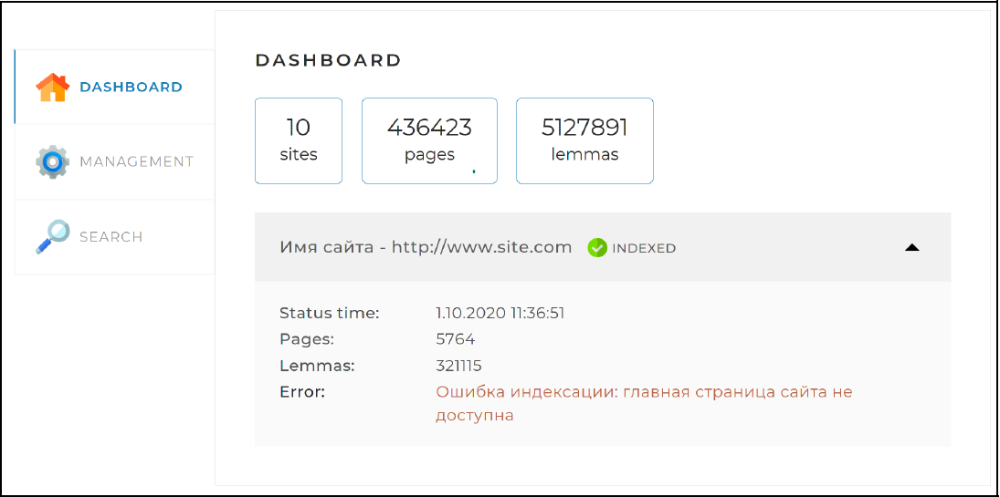
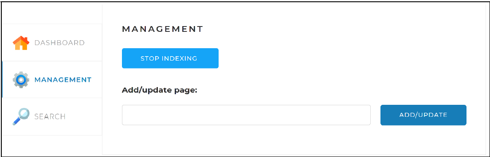
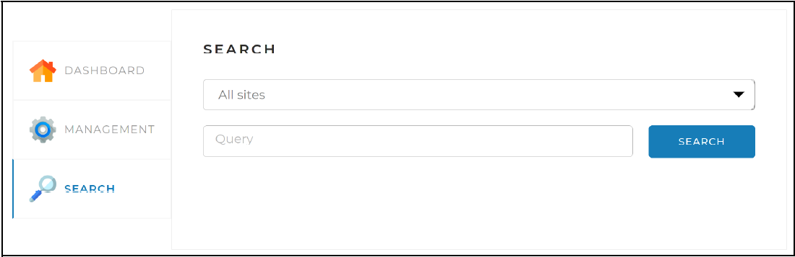
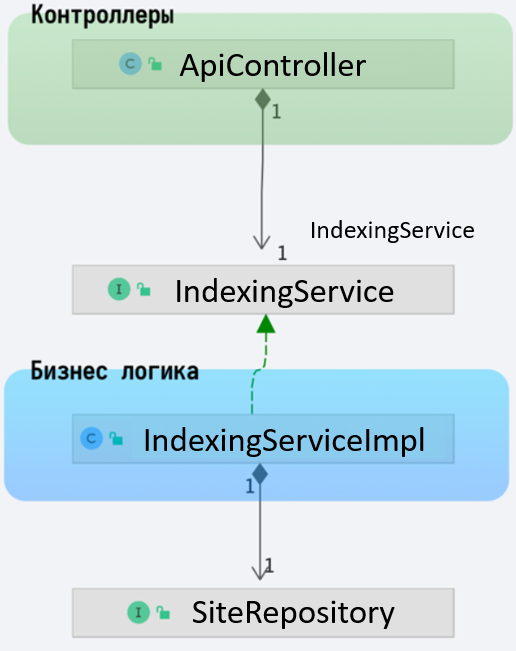
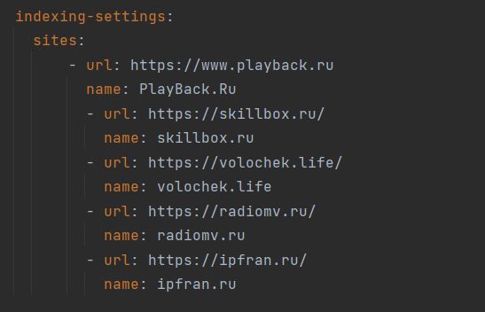

# Поисковый движок "Ventura" (Java Spring Framework)
## Описание проекта
Поисковый движок представлять из себя Spring-приложение, работающее с
локально установленной базой данных MySQL, имеющее простой
веб-интерфейс и API, через который им можно управлять и получать
результаты поисковой выдачи по запросу.

### Принципы работы поискового движка
1. В конфигурационном файле перед запуском приложения задаются
адреса сайтов, по которым движок должен осуществлять поиск.
2. Поисковый движок самостоятельно обходить все страницы заданных 
сайтов и индексирует их(создает так называемый индекс), чтобы 
потом находить наиболее релевантные страницы по любому поисковому 
запросу.
3. Пользователь присылает запрос через API движка. Запрос — это набор
слов, по которым нужно найти страницы сайта.
4. Запрос определённым образом трансформируется в список слов,
переведённых в базовую форму. Например, для существительных —
именительный падеж, единственное число.
5. В индексе ищутся страницы, на которых встречаются все эти слова.
6. Результат поиска ранжируется и отдается пользователю.

### Веб-интерфейс (frontend-составляющая) проекта представляет собой
### одну веб-страницу с тремя вкладками:

+ **Dashboard**. Эта вкладка открывается по умолчанию. На ней
отображается общая статистика по всем сайтам, а также детальная
статистика и статус по каждому из сайтов (статистика, получаемая по
запросу /api/statistics).



+ **Management**. На этой вкладке находятся инструменты управления
поисковым движком — запуск и остановка полной индексации
(переиндексации), а также возможность добавить(обновить) отдельную
страницу по ссылке.



+ **Search**. Эта страница предназначена для поиска слов по сайту(ам). На ней находится поле поиска, выпадающий список с выбором сайта для поиска, а при нажатии на кнопку «Найти» выводятся результаты поиска 
(по API-запросу /api/search).



## В проекте используются библиотеки лемматизаторы
+ *Apache lucene morphology* - лемматизатор  который используется в широко используемом поисковом движке Apache Solr([github](https://github.com/akuznetsov/russianmorphology)).

+ *Aot* - Java библиотека для быстрого (!) получения леммы и морфологической информации по заданному слову русского языка. Реинкарнация aot-lematizier с удобным обновленным API, избавленная от closed-source зависимостей, упрощенная для сборки, и как следствие легко подключаемая в другие проекты с помощью репозитория Jitpack([github](https://github.com/demidko/aot)).

## Структура проекта

Используется слоистая структура (еще называется "луковичная"). Есть три слоя:

* **Presentation** - контроллеры. Слой общается с пользователями, ожидает запросы по API и отдает ответы.
* **Business** - бизнес логика(расчеты, проверки и т.д.), содержится в классах Сервисах.
* **Data Access** - слой отвечает за хранение данных, подключение к БД, реализацию запросов.


Если посмотреть слои данного приложения, то увидим не только сами классы, но еще и интерфейсы между ними.



Интерфейсы нужны, чтобы слои приложения не зависели от реализаций классов. Каждый из классов ApiController и IndexingServiceImpl зависят от интерфейса IndexingService. Это значит, что сервисы и контроллеры могут меняться
независимо, заменяться и это не будет влиять на другие слои.

## Настройки для запуска

### Зависимости

Для успешного скачивания и подключения к проекту зависимостей
из GitHub необходимо настроить Maven конфигурацию в файле `settings.xml`.

В файле `pom.xml` добавлен репозиторий для получения jar файлов:

```xml
<repositories>
  <repository>
    <id>skillbox-gitlab</id>
    <url>https://gitlab.skillbox.ru/api/v4/projects/263574/packages/maven</url>
  </repository>
</repositories>
```
Для доступа к данному Maven-репозиторию требуется авторизации по токену, поскольку GitLab запрещает публичный доступ к
библиотекам. Для указания токена найдите или создайте файл
settings.xml.

* В Windows он располагается в директории `C:/Users/<Имя вашего пользователя>/.m2`
* В Linux директория `/home/<Имя вашего пользователя>/.m2`
* В macOs по адресу `/Users/<Имя вашего пользователя>/.m2`

>**Внимание!** Актуальный токен, строка которую надо вставить в тег `<value>...</value>`
[находится в документе по ссылке](https://docs.google.com/document/d/1rb0ysFBLQltgLTvmh-ebaZfJSI7VwlFlEYT9V5_aPjc/edit?usp=sharing). 

Добавьте внутри тега `settings` текст конфигурации:

```xml
<servers>
  <server>
    <id>skillbox-gitlab</id>
    <configuration>
      <httpHeaders>
        <property>
          <name>Private-Token</name>
          <value>token</value>
        </property>
      </httpHeaders>
    </configuration>
  </server>
</servers>
```

**Не забудьте поменять токен на актуальный!**

❗️Если файла нет, то создайте `settings.xml` и вставьте в него:

```xml
<settings xmlns="http://maven.apache.org/SETTINGS/1.0.0"
          xmlns:xsi="http://www.w3.org/2001/XMLSchema-instance"
          xsi:schemaLocation="http://maven.apache.org/SETTINGS/1.0.0
 https://maven.apache.org/xsd/settings-1.0.0.xsd">

  <servers>
    <server>
      <id>skillbox-gitlab</id>
      <configuration>
        <httpHeaders>
          <property>
            <name>Private-Token</name>
            <value>token</value>
          </property>
        </httpHeaders>
      </configuration>
    </server>
  </servers>

</settings>
```
**Не забудьте поменять токен на актуальный!**

После этого, в проекте обновите зависимости (Ctrl+Shift+O / ⌘⇧I) или
принудительно обновите данные из pom.xml. Для этого вызовите контекстное меню у файла `pom.xml` в дереве файлов проекта и выберите пункт меню **Maven -> Reload Project**.


⁉️ Если после этого у вас остается ошибка:

```text
Could not transfer artifact org.apache.lucene.morphology:morph:pom:1.5
from/to gitlab-skillbox (https://gitlab.skillbox.ru/api/v4/projects/263574/packages/maven):
authentication failed for
https://gitlab.skillbox.ru/api/v4/projects/263574/packages/maven/russianmorphology/org/apache/lucene/morphology/morph/1.5/morph-1.5.pom,
status: 401 Unauthorized
```

Почистите кэш Maven. Самый надежный способ, удалить директорию:

- Windows `C:\Users\<user_name>\.m2\repository`
- macOs `/Users/<user_name>/.m2/repository`
- Linux `/home/<user_name>/.m2/repository`

где `<user_name>` - имя пользователя под которым вы работаете.

После этого снова попробуйте обновить данный из `pom.xml`.

### Настройки подключения к БД

В проект добавлен драйвер для подключения к БД MySQL. Перед запуском проекта убедитесь, что у вас запущен сервер MySQL 8.x.

🐳 Если у вас установлен докер, можете запустить контейнер с готовыми настройками
под проект командой:

```bash
docker run -d --name=springSearchEngine -e="MYSQL_ROOT_PASSWORD=testtest" -e="MYSQL_DATABASE=search_engine" -p3306:3306 mysql
```

Имя пользователя по-умолчанию `root`, настройки проекта в `application.yml`
соответствуют настройкам контейнера, менять их не требуется.

❗️ Если у вас MacBook c процессором M1, необходимо использовать специальный
образ для ARM процессоров:

```bash
docker run -d --name=springSearchEngine -e="MYSQL_ROOT_PASSWORD=testtest" -e="MYSQL_DATABASE=search_engine" -p3306:3306 arm64v8/mysql:oracle
```

Если используете MySQL без докера, то создайте бд `search_engine` и замените логин и пароль в файле конфигурации `application.yml`, который находится в корне проекта:

```yaml
spring:
  datasource:
    username: root # имя пользователя
    password: testtest # пароль пользователя
```

### Указание перечня сайтов для индексации и поиска

В конфигурационном файле `application.yml`, который находится в корне проекта, задайте адреса сайтов, по которым движок должен осуществлять поиск.


____

**После настройки для запуска**, можете запустить проект. Если введены правильные данные, проект успешно запуститься. Если запуск заканчивается ошибками, изучите текст ошибок, внесите исправления и попробуйте заново.